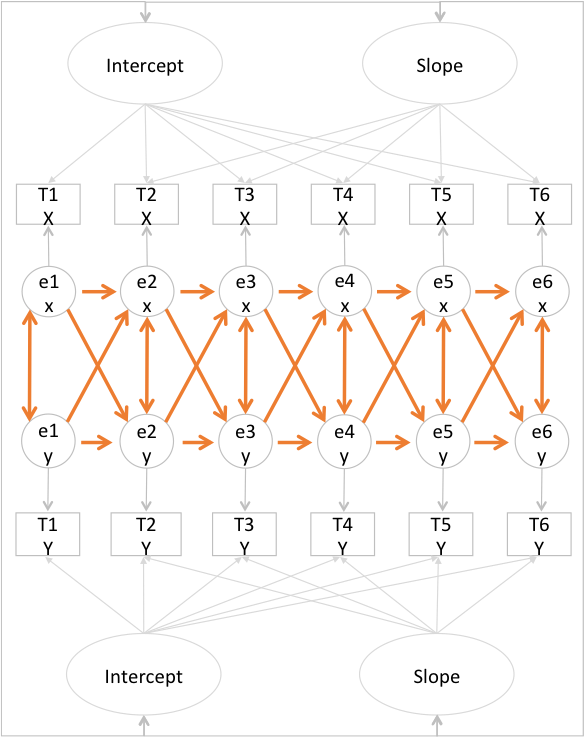
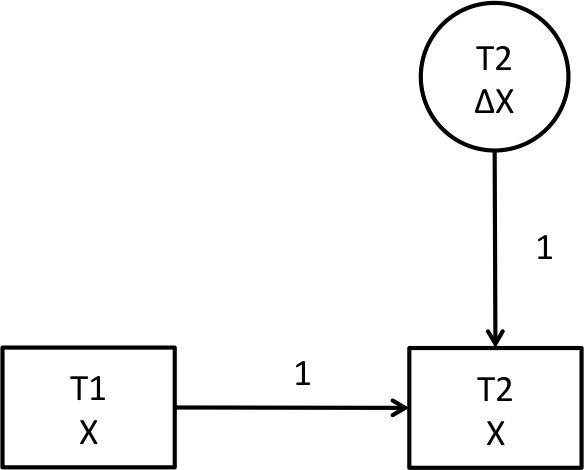
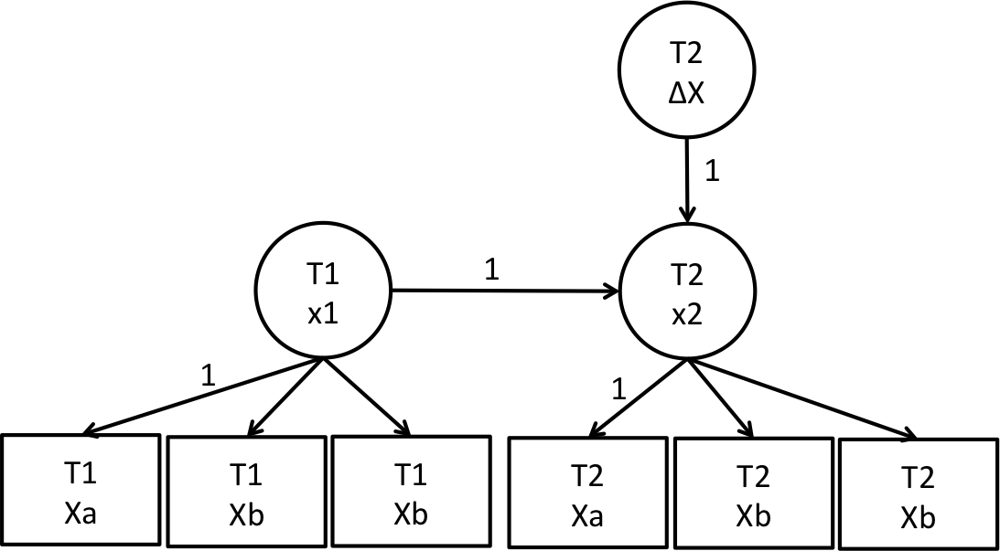
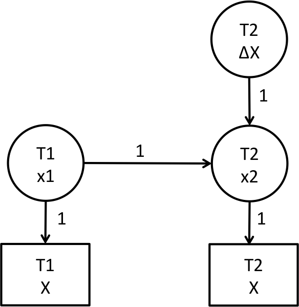
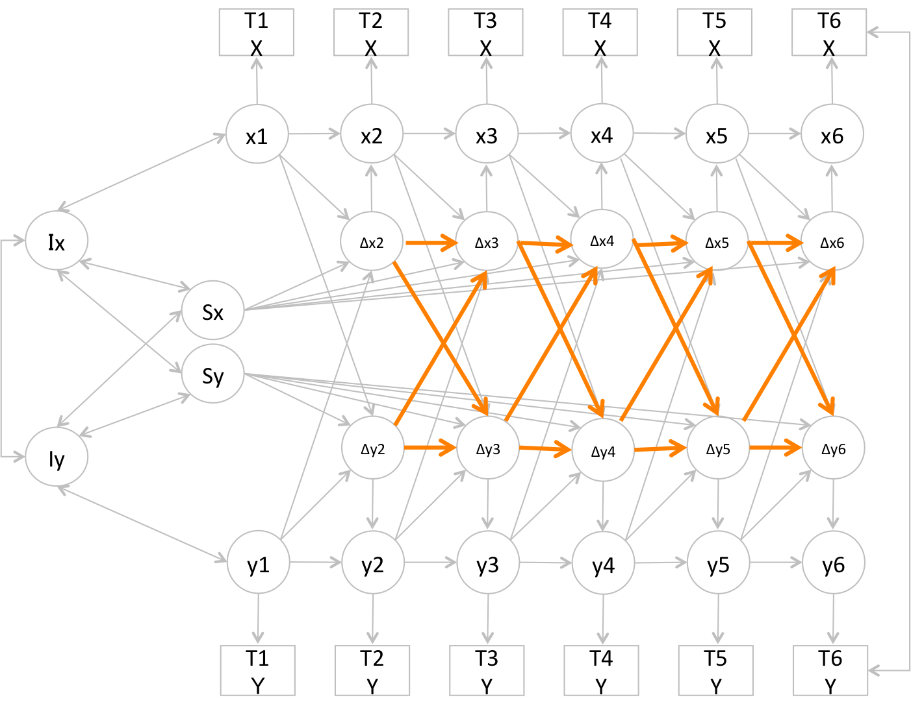

```{r, results='hide',echo=F,message=F,warning=F}
library(knitr)
opts_chunk$set(warning=F, message=F,echo=F)
```

# Topics  

## 縦断データ解析　 

### 1. 非線形の成長曲線モデル 
  - polynominal model
  - latetn basis model 
  - piecewise models
  
###　  
  
      
### 2.多変量の成長曲線モデル
  - parallel process growth model
  - autoregressive latent trajectory Model
  - latent change score model


## McArdle (2010)の5ステップ
- 縦断データ解析の進め方

|step|       purpose            |     model|
|---:|-------------------------:|---------:|
|1   |観測変数の記述            |          |
|2   |遷移パターンの検討        |       LGM|
|3   |2の個人差予測  　　　　　 |共変量+LGM|
|4   |変数間の因果的関連        |      LCMS|
|5   |4のクラスタリング         |       GMM|

<font size="2"> LCM=latent growth model, LCS=latent change score model, GMM=growth mixure model</font>  
<font size="1">McArdle, J. J., & Grimm, K. J. (2010). Five steps in latent curve and latent change score modeling with longitudinal data. In Longitudinal research with latent variables (pp. 245-273). Springer Berlin Heidelberg.</font>

# 非線形モデルのモチベ

##　変化は線形とは限らない  
- 現実では寧ろ稀
- データにfitするモデルが欲しい
- 予測の向上

## ２次(以上)の曲線で

```{r, out.width = 500, fig.retina = NULL}
knitr::include_graphics("img/quad.jpeg")
```
  
### polynominal model  

## データドリブンに

```{r, out.width = 500, fig.retina = NULL}
knitr::include_graphics("img/latent.jpeg")
```
  
### latent basis model  

## ある時点から傾きが異なる

```{r, out.width = 500, fig.retina = NULL}
knitr::include_graphics("img/piecewise1.jpg")
```


### piecewise model  

# サンプルデータ

## ポジ感情の経時データ
- Garland et al. (2015)の記述統計と相関行列から名のデータ生成
- 
```{r,echo=F, results="asis"}
data<-read.csv("data/Garland.csv",header=T)
data<-data[,2:7]

library(ggplot2)
library(plyr)
library(shiny)
library(shinyapps)

M<-as.data.frame(t(sapply(data,each(mean,sd))))
M<-round(M,digits=2)
M$time<-0:5

library(DT)
M2<-t(M)
#datatable(M2, options = list(dom = 't',  initComplete #= JS(
#    "function(settings, json) {",
#    "$(this.api().table().header()).css({'background-#color': '#E8A317', 'color': '#fff'});",
#    "}")))
kable(M2)
```

##　なだらかな減少傾向？

```{r, fig.width=5, fig.height=2}
ggplot(M, aes(x=time,y=mean, group=1))+ 
              geom_line(col="blue", size=3)+
              ylim(3,4)+
              #geom_line(aes(y=mean.Y,group=1),size=3,col="red")+
              theme_bw()
```

<font size="1">
Garland, E. L., Geschwind, N., Peeters, F., & Wichers, M. (2015). Mindfulness training promotes upward spirals of positive affect and cognition: multilevel and autoregressive latent trajectory modeling analyses. Frontiers in psychology, 6.</font>


# Rで潜在成長曲線モデル

## まじめに書くと
```
level =~ 1* bmi1 +1* bmi2 +1* bmi3 +
         1* bmi4 +1* bmi5 +1* bmi6 
slope =~ 0 * bmi1 + 1 * bmi2 + 2 * bmi3 + 
         3 * bmi4 + 4 * bmi5 + 5 * bmi6 
bmi1 ~~(vare)* bmi1 
bmi2 ~~(vare)* bmi2 
bmi3 ~~(vare)* bmi3 
bmi4 ~~(vare)* bmi4 
bmi5 ~~(vare)* bmi5 
bmi6 ~~(vare)* bmi6 
```
結構めんどい...

## 救世主登場
### RAMpathパッケージ  
- 潜在成長曲線系のlavaanコードを自動生成して実行してくれる関数が充実    
    - 成長曲線モデル: ramLCM    
    - 潜在差得点モデル:ramLCS    
    - 2変量の潜在差得点モデル: ramBLCS    
     
- lavaanのモデルを吐き出せるので、RAMpathで実行した後lavaanで微調整という流れで効率よくモデリング

## ramLCM
- 切片のみのモデル (model='no')
    
- 線形モデル (model='linear')
    
- 二次曲線モデル (model='quadratic')
    
- latent basisモデル (model = 'latent')

## 一行で簡潔に推定
### 一気にどん
```{r, echo=T, results='hide'}
library(RAMpath)
fit.all<-ramLCM(data=data,outcome=1:6, model='all')
```

### 個別にどん
```{r, echo=T, results='hide'}
fit.no<-ramLCM(data=data,outcome=1:6, model='no')
fit.linear<-ramLCM(data=data,outcome=1:6, model='linear')
fit.quadratic<-ramLCM(data=data,outcome=1:6, model='quadratic')
fit.latent<-ramLCM(data=data,outcome=1:6, model='latent')
```

## 切片のみモデル
 lavaanコード
```{r, echo=T}
cat(fit.all$model$no)
```
- 傾き因子を排除
- 初期値から得点の変化なし


## 線形モデル
 lavaanコード
```{r, echo=T}
cat(fit.all$model$linear)
```
- 傾き因子の因子負荷が単調増加
  (0, 1, 2, 3, 4, 5)


## 二次曲線モデル
 lavaanコード
```{r, echo=T}
cat(fit.all$model$quadratic)
```
- 二つ目の傾き因子の負荷は, 一つ目の傾き因子の二乗
  (0, 1, 4, 9, 16, 25)


## latent basisモデル
 lavaanコード
```{r, echo=T}
cat(fit.all$model$latent)
```
- 傾きの因子負荷を自由推定する
- データドリブンな遷移パターン


## 適合度
- 2次曲線モデルの適合が良い
```{r, echo=T}
fits<-round(fit.all$fit[
            c("chisq","df","pvalue","cfi",
              "srmr","rmsea","aic","bic"),],digits=2)
datatable(fits,option=list(dom='t'))
```

## 遷移プロット
- plot.growth関数(自作)
```{r, echo=T}
source("script/plot.growth.R")
a<-plot.growth(fit.all, type="no")+theme_bw()
b<-plot.growth(fit.all, type="lin")+theme_bw()
c<-plot.growth(fit.all, type="quad")+theme_bw()
d<-plot.growth(fit.all, type="latent")+theme_bw()
```
```{r}
library(grid)
grid.newpage() #空の画面を作る
pushViewport(viewport(layout=grid.layout(2, 2))) 
print(a, vp=viewport(layout.pos.row=1, layout.pos.col=1)) 
print(b, vp=viewport(layout.pos.row=1, layout.pos.col=2)  ) 
print(c, vp=viewport(layout.pos.row=2, layout.pos.col=1)  ) 
print(d, vp=viewport(layout.pos.row=2, layout.pos.col=2)  ) 
```


## ポチるおまけ 

```{r, echo=F}
datatable(fits, extensions = 'Buttons', 
          options = list(dom = 'B',
          buttons = c('copy', 'csv', 'excel', 'pdf', 'print')))
```


## 推定結果の出力

```{r, echo=T}
parm<-parameterEstimates(fit.all$lavaan$quadratic)
parm[,5:10]<-round(parm[,5:10],digits=3)
datatable(parm[c(37:39,28:30,25:27),],
          extensions = 'Scroller', 
          options = list(dom= ' t',
                         deferRender = TRUE, 
                         scrollY = 200, 
                         scroller = TRUE))
```

- 切片の平均は3.36, 傾きの平均は0に近い  
- 切片の分散は大きい  
- 1次の傾きは少し分散あり, 2次の傾きはない  
- 切片と傾きに関連はあまりない  

# Piecewise Model

##　コード全体
- 時点4で区切ってみる
```{r, echo=T}
model1 <-'

#切片因子の設定
i =~ 1*X1 + 1*X2 + 1*X3 + 
1*X4 + 1*X5 + 1*X6

#傾き因子の設定
s1 =~ 0*X1 + 1*X2 + 2*X3 +
3*X4 + 3*X5 + 3*X6

s2 =~ 0*X1 + 0*X2 + 0*X3 +
0*X4 + 1*X5 + 2*X6


#切片と傾きの分散
i ~~ i ; s1 ~~ s1 ; s2 ~~ s2; 

#因子間相関
i ~~ s1 + s2; s1 ~~ s2

#因子平均
i ~ 1 ; s1 ~ 1 ; s2 ~ 1

#誤差分散
X1 ~ 0; X2 ~ 0; X3 ~ 0
X4 ~ 0; X5 ~ 0; X6 ~ 0
'
```
```{r}
model1.2 <-'

#切片因子の設定
i =~ 1*X1 + 1*X2 + 1*X3 + 
1*X4 + 1*X5 + 1*X6

#傾き因子の設定
s1 =~ 0*X1 + 1*X2 + 2*X3 +
3*X4 + 3*X5 + 3*X6

s2 =~ 0*X1 + 0*X2 + 0*X3 +
0*X4 + 1*X5 + 2*X6


#切片と傾きの分散
i ~~ i ; s1 ~~ s1 ; s2 ~~ s2; 

#因子間相関
i ~~ s1 + s2; s1 ~~ s2

#因子平均
i ~ 1 ; s1 ~ (a)*1 ; s2 ~ (a)*1

#誤差分散
X1 ~ 0; X2 ~ 0; X3 ~ 0
X4 ~ 0; X5 ~ 0; X6 ~ 0
'
```

## 切片因子の設定  
- 因子負荷を1に固定 

```
#lavaan code
i =~ 1*t1+1*t2+1*t3+1*t4+1*t5
```
```{r, echo=F}
source("script/diag.R")
library(DiagrammeR)
grViz(int)
```

## 前半の傾きの設定  
前半の傾き(s1)の因子負荷を  
区分時点以降同値に固定  

```
#lavaan model code
i=~0*t1+1*t2+2*t3+3*t4+3*t5+3*t6
```
```{r, fig.align='right', echo=F}
grViz(s1)
```

## 後半の傾きの設定
後半の傾き(s1)の因子負荷を  
区分時点まで0に固定  
```
#lavaan model code
i=~0*t1+0*t2+0*t3+0*t4+1*t5+2*t6
```
```{r, fig.align='right', echo=F}
grViz(s2)
```


## その他の設定
- 切片と傾きの分散を自由推定
- 因子間相関を自由推定
- 因子平均を自由推定
- 誤差分散を0に固定  

```
#切片と傾きの分散
i ~~ i ; s1 ~~ s1 ; s2 ~~ s2
#因子間相関
i ~~ s1 + s2 ; s1 ~~ s2
#因子平均
i ~ 1 ; s1 ~ 1 ; s2 ~ 1
#誤差分散
bmi1 ~ 0; bmi2 ~ 0; bmi3 ~ 0
bmi4 ~ 0; bmi5 ~ 0; bmi6 ~ 0
```


## 推定の実行  

```
library(lavaan)
model1.fit<-lavaan::growth(model1, data)
```
```{r, echo=F}

model1.fit<-lavaan::growth(model1, data=data)
model1.2fit<-lavaan::growth(model1.2, data=data)


library(tidyr)
newdata<-as.data.frame(lavPredict(model1.fit, type = "ov"))
newdata$id<-1:length(newdata[,1])

newdata.l<-gather(newdata,time,value,X1:X6)
newdata.l$time<-as.factor(newdata.l$time)
newdata.l$time<-as.numeric(newdata.l$time)-1

mean.pred<-apply(newdata,2, mean)
sd.pred<-apply(newdata,2, sd)
low<-mean.pred-1.96*sd.pred
up<-mean.pred+1.96*sd.pred


pred<-data.frame(mean=mean.pred,sd=sd.pred,lowerCI=low,upperCI=up)[-7,]
pred$time<-0:5

library(ggplot2)
ggplot(pred,aes(x=time,y=mean,group=1))+ 
geom_point(size=3)+ylim(3.25, 3.40)+geom_line()+theme_bw()+
geom_vline(xintercept = 3,  lty=2)

```


## フィットしてる？

```
fit1.m<-round(fitMeasures(model1)[c("chisq","df","pvalue",
"cfi","srmr","rmsea")],digits=2)
fit1.m<-t(as.data.frame(fit1))
print(xtable(fit1.m),comment=F,type="html")
```
### piecewiseの方がfit 

- piecewise
```{r}
fit1.m<-round(fitMeasures(model1.fit)
[c("chisq","df","pvalue",
"cfi","srmr","rmsea", "aic", "bic")],digits=2)
fit1.m<-t(as.data.frame(fit1.m))
datatable(fit1.m,options=list(dom="t"))
```

- quadratic
```{r}
datatable(t(fits[,4]),option=list(dom='t'))
```


## 前半と後半の傾きに違いがあるか？
- 傾き因子の平均に等値制約を置いたモデルと比較
```
#傾き因子平均が等値
s1 ~ (a)*1 ; s2 ~ (a)*1
```
```{r, echo=T}
# model1.2fit = 等値制約のモデル
anova(model1.2fit, model1.fit)
```

今回のモデルでは期間による傾きの違いは認められない

## もうちょい頑張る
- 前半を２次曲線モデルに
```{r, echo=T}
model2 <-'
#切片因子の設定
i =~ 1*X1 + 1*X2 + 1*X3 + 1*X4 + 1*X5 + 1*X6

#傾き因子の設定
s1 =~ 0*X1 + 1*X2 + 2*X3 +3*X4 + 3*X5 + 3*X6
s2 =~ 0*X1 + 1*X2 + 4*X3 +9*X4 + 9*X5 + 9*X6
s3 =~ 0*X1 + 0*X2 + 0*X3 +0*X4 + 1*X5 + 2*X6

#切片と傾きの分散
i ~~ i ; s1 ~~ s1 ; s2 ~~ s2; s3 ~~ s3; 

#因子間相関
i ~~ s1 + s2 + s3; s1 ~~ s2 + s3 ; s2 ~~ s3 ;

#因子平均
i ~ 1 ; s1 ~ 1 ; s2 ~ 1 ; s3 ~ 1

#誤差分散
X1 ~ 0; X2 ~ 0; X3 ~ 0; X4 ~ 0; X5 ~ 0; X6 ~ 0
'
```

##　どやさ
### quadからlinearのpiecewiseがfit!!

- 今回の適合度
```{r, echo=T}
model2.fit<-lavaan::growth(model2, data=data)
fit2.m<-round(fitMeasures(model2.fit)
[c("chisq","df","pvalue",
"cfi","srmr","rmsea")],digits=2)
fit2.m<-t(as.data.frame(fit2.m))
datatable(fit2.m,options=list(dom="t"))
```

- さっきのpiecewiseモデル
```{r, results='asis'}
fit1.m<-round(fitMeasures(model1.fit)
[c("chisq","df","pvalue",
"cfi","srmr","rmsea")],digits=2)
fit1.m<-t(as.data.frame(fit1.m))
datatable(fit1.m,options=list(dom="t"))
```

## データに応じて柔軟なモデリング
- コードは長いので省略(githubでみれます)
```{r}
library(tidyr)
newdata<-as.data.frame(lavPredict(model2.fit, type = "ov"))
newdata$id<-1:length(newdata[,1])

newdata.l<-gather(newdata,time,value,X1:X6)
newdata.l$time<-as.factor(newdata.l$time)
newdata.l$time<-as.numeric(newdata.l$time)-1

mean.pred<-apply(newdata,2, mean)
sd.pred<-apply(newdata,2, sd)
low<-mean.pred-1.96*sd.pred
up<-mean.pred+1.96*sd.pred

pred<-data.frame(mean=mean.pred,sd=sd.pred,lowerCI=low,upperCI=up)[-7,]
pred$time<-0:5

library(ggplot2)
plot(pred$time,  pred$mean, bty="l")
f=function(x)3.4344+-0.220*x+0.062*(x^2)
curve(f, from=0, to=3, add=T, bty="l",col="blue")
f=function(x)3.335+(0.040*3)+(-0.040*x)
curve(f, from=3, to=5, add=T, bty="l",col="blue")
abline(v=3, lty=2)
```


##　切片が期間で異なる
- 二つ切片因子を設定
- 前半: 区切り以前を1, 以降を0
- 後半: 区切り以前を0, 以降を1
```{r, echo=T}
model2.2 <-'
i1 =~ 1*X1 + 1*X2 + 1*X3 + 0*X4 + 0*X5 + 0*X6
i2 =~ 0*X1 + 0*X2 + 0*X3 + 1*X4 + 1*X5 + 1*X6
s1 =~ 0*X1 + 1*X2 + 2*X3 + 3*X4 + 3*X5 + 3*X6
s2 =~ 0*X1 + 0*X2 + 0*X3 + 0*X4 + 1*X5 + 2*X6

i1 ~~ i1
i2 ~~ i2
s1 ~~ s1
s2 ~~ s2

i1 ~~ i2 + s1 + s2
i2 ~~ s1 + s2 
s1 ~~ s2
i1 ~ 1
i2 ~ 1
s1 ~ 1
s2 ~ 1

X1 ~ 0
X2 ~ 0
X3 ~ 0
X4 ~ 0
X5 ~ 0
X6 ~ 0 '
```

## こんなプロットになる
- コードは省略(githubでみれます)
```{r}
library(lavaan)
model2.fit<-lavaan::growth(model2.2, data=data)

newdata2<-as.data.frame(lavPredict(model2.fit, type = "ov"))
newdata2$id<-1:length(newdata2[,1])

library(tidyr)
newdata2.l<-gather(newdata2,time,value,X1:X6)
newdata2.l$time<-as.factor(newdata2.l$time)
newdata2.l$time<-as.numeric(newdata2.l$time)-1

library(plyr)
mean.pred<-apply(newdata,2, mean)
sd.pred<-apply(newdata,2, sd)
low<-mean.pred-1.96*sd.pred
up<-mean.pred+1.96*sd.pred

pred<-data.frame(mean=mean.pred,sd=sd.pred,lowerCI=low,upperCI=up)[-7,]
pred$time<-0:5

plot(pred$time,  pred$mean, bty="l", col="white", ylim=c(3,4))
f=function(x)3.475+(-0.112*x)
curve(f, from=0, to=3, add=T, bty="l",col="blue")
f=function(x)3.38+0.177+(-0.039*x)
curve(f, from=3, to=5, add=T, bty="l",col="blue")
abline(v=3, lty=2)
```
```{r, results='asis'}
fit2.m<-round(fitMeasures(model2.fit)
[c("chisq","df","pvalue",
"cfi","srmr","rmsea")],digits=2)
fit2.m<-t(as.data.frame(fit2.m))
datatable(fit2.m,options=list(dom="t"))
```

## 成長曲線モデルまとめ
- 切片と傾きの因子負荷の設定で柔軟にモデリング
- 遷移パターンは複数のモデルを比較検討
- 定番は切片のみ、線形、二次曲線、latent basis
- 定番モデルはRAMpath パッケージで瞬殺
- lavannコードを吐き出してモデル微調整
- 区切りが明確な場合はpiecewiseも試してみよう


# ２変量の関係性が知りたい

## 2つの時系列データ
### ポジ感情(X)とポジ認知(Y)の経時データ
```{r,echo=F, results="hide"}
data<-read.csv("data/Garland.csv",header=T)

M<-as.data.frame(t(sapply(data,each(mean,sd))))
M<-round(M[-1,],digits=2)
M$time<-rep(0:5,2)

library(DT)
M2<-t(M)
#datatable(M2, options = list(dom = 't',  initComplete #= JS(
#    "function(settings, json) {",
#    "$(this.api().table().header()).css({'background-#color': '#E8A317', 'color': '#fff'});",
#    "}")))
M$var[1:6]<-paste0(rep("X",6))
M$var[7:12]<-paste0(rep("Y",6))
kable(M2)
```

## 一見似たようなプロット　

```{r, fig.width=5, fig.height=2}
ggplot(M, aes(x=time,y=mean, group=1))+ 
              geom_line(col="blue", size=3)+
              ylim(3.1,3.50)+facet_wrap(~var)+
              #geom_line(aes(y=mean.Y,group=1),size=3,col="red")+
              theme_bw()
```

<font size="1">
Garland, E. L., Geschwind, N., Peeters, F., & Wichers, M. (2015). Mindfulness training promotes upward spirals of positive affect and cognition: multilevel and autoregressive latent trajectory modeling analyses. Frontiers in psychology, 6.</font>


## 有効なモデル
- parallel process growth model
- auto regressive latent trajectory model
- latent change score model


# parallel process growth model  
## 　
1. 各変数に最適な潜在成長曲線モデルを検討
2. 潜在変数(切片と傾き)間の相関を推定


## lavaanで実行
- 暫定的に以下のモデルで
    - ポジ感情: 2次曲線モデル
    - ポジ認知: 切片のみのモデル

```{r, echo=T}
parallel<-'
# posi感情のモデル (2次)
level.X =~ 1* X1 +1* X2 +1* X3 +1* X4 +1* X5 +1* X6 
slope.X =~  0 * X1 + 1 * X2 + 2 * X3 + 3 * X4 + 4 * X5 + 5 * X6 
quadratic.X =~  0 * X1 + 1 * X2 + 4 * X3 + 9 * X4 + 16 * X5 + 25 * X6 

# posi認知のモデル (切片のみ)
level.Y =~ 1* Y1 +1* Y2 +1* Y3 +1* Y4 +1* Y5 +1* Y6 

'
```

## 推定結果

```{r, echo=T}
para<-lavaan::growth(parallel, data)
round(fitmeasures(para)[
            c("chisq","df","pvalue","cfi",
              "srmr","rmsea","aic","bic")],digits=2)
```

- フィットしてない...

## 因子間相関
```{r, echo=T}
parameterEstimates(para,standardized=T)[41:46,c(1:3,11,7)]
```
- 因子間相関はそこそこ相関が高い
- Yのベースラインが高いほど、X傾きが正に大きくなる
- X変数の1次の傾きと2次の傾き因子の相関が高い
    - 因子負荷を中心化するのも有効 (多重共線性を回避)

## ねばってみる
- 傾き因子の係数がとても小さいので省く
- 同時点の残差間に共分散を仮定する

```{r, echo=T}
parallel2<-'
# posi感情のモデル (2次)
level.X =~ 1* X1 +1* X2 +1* X3 +1* X4 +1* X5 +1* X6 
# posi認知のモデル (切片のみ)
level.Y =~ 1* Y1 +1* Y2 +1* Y3 +1* Y4 +1* Y5 +1* Y6 

X1 ~~ Y1
X2 ~~ Y2
X3 ~~ Y3
X4 ~~ Y4
X5 ~~ Y5
X6 ~~ Y6
'
```

## そこそこの適合度に

```{r, echo=T}
para2<-lavaan::growth(parallel2, data)
round(fitmeasures(para2)[
            c("chisq","df","pvalue","cfi",
              "srmr","rmsea","aic","bic")],digits=2)
```

## 相関は...?

```{r, echo=T}
summary(para2, standardized=T, fit.measures=T)
```

- ベースラインのポジ感情の高さとベースラインのポジ認知の高さに正の関連あり...


## 物足りない
- 変数間の因果にせまれない  
- 時点間の自己相関や相互相関が考慮されない  


# ALTM

## ALTM
- Bollen & Curran(2004)が提唱
- 交差遅延モデルと成長曲線モデルのハイブリッド


<font size="1">
Bollen, K. A., & Curran, P. J. (2004). Autoregressive latent trajectory (ALT) models a synthesis of two traditions. Sociological Methods & Research, 32(3), 336-383.</font>


## ２変数の時系列データ


## 交差遅延効果モデル
- cross-lagged effect model


## ppLGM
- pp = parallel process


## cross-laggedとppLGM=ALTM


## 自己回帰のパス

- 変数の安定性


例) T1の得点が高いとT2でも高い 

## 交差遅延のパス
- 変数間の因果関係


例) T1のXが高いとT2のYが高くなる

## 遷移パターン (切片と傾き)


- 成長曲線モデルと同様の解釈

## lavaanでALTM
```{r, echo=T}
source('script/bivALTM.R')
cat(ALTM)
```
- さっきのppLGMでポジ感情の傾きは小さい値だったので、モデルから除いた

## 適合度が少し良くなった？
```{r, echo=T}
summary(AL<-growth(ALTM, data), standardized=T, fit.measures=T)
```

## 推定結果を元に色々なモデルを検討する
- 自己回帰あり,なし
- 自己回帰に等値制約
- クロスラグに等値制約
- クロスラグが一方のみ
- など

## 自己回帰と交差遅延に等値制約
```{r, echo=T}
cat(ALTM2)
```

## 自己回帰だけ等値制約
```{r, echo=T}
cat(ALTM3)
```

## 自己回帰を推定しない
```{r, echo=T}
cat(ALTM4)
```

## 各モデルを比較
```{r, echo=T}
AL2<-growth(ALTM2, data); AL3<-growth(ALTM3, data); AL4<-growth(ALTM4, data)
library(semTools)
compareFit(para2,AL,AL2, AL3,AL4)
```

- 今回のデータでは、自己回帰や交差遅延モデルの効果がないため、parallel process growth modelでもALTMでも、さほど変わらない。ALTMを実施することで、変数間の因果的な関係も検討できる。

## さらにもう一歩...
- CurranのLCM−SRモデル
- 残差構造に交差遅延モデルをかますのもいいらしい
- このモデルで, 個人間効果と個人内効果を明確分離できるらしい 
- 潜在成長曲線；beween person effect
- 残差の交差遅延：within person effect
- 詳細は以下
<font size="1">
Curran, Patrick J., et al. "The separation of between-person and within-person components of individual change over time: A latent curve model with structured residuals." Journal of consulting and clinical psychology 82.5 (2014): 879.</font>

## CurranのLCM−SRモデル
- SR = structured residuals



## まとめ (ALTM)
- 遷移パターンに加えて, 
    - 各変数の自己回帰特性を検討
    - 変数間の因果的関係性を検討
    - 等値制約等複数のモデルを比較検討し、遅延交差モデルの様相を検討


# LCS
## 複雑さ、ドンと来い
- ppLGMやALTMは, 3次以上の傾きを含んだ複雑な遷移パターンをもつ観測変数間のモデリングが不得手
- 潜在差得点モデル (latent change model or latent difference model)は、そのような複雑な遷移パターンで、かつパターンの個人差が大きい縦断データに適している

## 差得点
- 差得点 = T2 - T1
- T2の得点 = 差得点 + T1
    - 1時点後の得点は, 1時点前の得点と差得点を足し合わせた得点になる

## 潜在差得点
- 観測変数から潜在変数で差得点の平均と分散を推定
- T2へのパスは1に固定



## 因子モデル型
- 因子得点を利用して差得点を推定


## Phantom型
- よく使用される
- 因子得点を利用して差得点を推定


## 時系列データ二つ


## 観測変数を潜在化+自己回帰のパス


## 各時点の変化量を潜在化


## betaパス
- proportional change parameter


例) 1時点前の得点が高いor低いと次の時点では得点の変化が大きくなる(平均への回帰) 


## cont(betaパス)
- self-feedback effectとも呼ばれる
- betaパスをモデルに含むと, 潜在差(latent change)とセルフフィードバック(proportional change)の二つの変化を含むモデルになるので, dual change modelと呼ばれることもある


## gammaパス
- coupling parameter
- 2変数間の因果的関係性を示す


例) １時点前の一方の変数の得点が高いor低いと、次の時点におけるもう一方の変数の得点の変化が大きくなる。


## 成長モデル
- 傾きは潜在差得点に負荷するのでパスは全て1に固定
- 切片はT1のファントム潜在変数に負荷しパスを1に固定


## Grimmら (2012) による拡張
- 潜在変化量間に交差遅延モデルを組み込む
- 変化が変化を生む



## Rで2変量LCSM
- ramPATHパッケージのramBLCS関数
- データはパッケージ付属のサンプルデータを使用
```{r}
library(RAMpath)
data(ex3)
bLCS<-ramBLCS(data=ex3, 7:12, 1:6)
```

複雑なモデルを1行で済ませてくれる

## 複雑さを肌で感じる
```{r}
cat(bLCS$model)
```

## 長いだけで中は単純
-Yを指定を解説
-Xも同様の指定
```
# 切片をT1のファントム変数に負荷
 y0 =~ 1*y1 
 
# ファントム変数間の自己回帰
 y2~1*y1
 y3~1*y2
 y4~1*y3
 y5~1*y4
 y6~1*y5

# 差得点から同時点のファントム変数へのパス
 dy2=~1*y2
 dy3=~1*y3
 dy4=~1*y4
 dy5=~1*y5
 dy6=~1*y6
 
# betaパス 等値制約 (ファントムから差得点)
 dy2~betay*y1 
 dy3~betay*y2 
 dy4~betay*y3 
 dy5~betay*y4 
 dy6~betay*y5 

# 傾きから差得点への因子負荷1に固定
 ys=~1*dy2
 ys=~1*dy3
 ys=~1*dy4
 ys=~1*dy5
 ys=~1*dy6

# 差得点とファントムの平均と分散は0に固定
#分散
 dy2~~0*dy2
 dy3~~0*dy3
 dy4~~0*dy4
 dy5~~0*dy5
 dy6~~0*dy6
 y1~~0*y1
 y2~~0*y2
 y3~~0*y3
 y4~~0*y4
 y5~~0*y5
 y6~~0*y6

#平均 
 y1~0*1
 y2~0*1
 y3~0*1
 y4~0*1
 y5~0*1
 y6~0*1
 dy2~0*1
 dy3~0*1
 dy4~0*1
 dy5~0*1
 dy6~0*1
 
# 切片と傾きの平均と分散と共分散 
  ys~~vary0ys*y0 
  y0~~vary0*y0 
  ys~~varys*ys 
  ys~mys*1 
  y0~my0*1 

#ファントム変数の作成
y1=~1*Y7
y2=~1*Y8
y3=~1*Y9
y4=~1*Y10
y5=~1*Y11
y6=~1*Y12

# 観測変数の平均を0に固定
Y7~0*1
Y8~0*1
Y9~0*1
Y10~0*1
Y11~0*1
Y12~0*1

# 観測変数の分散に等値制約
Y7~~varey*Y7 
 Y8~~varey*Y8 
 Y9~~varey*Y9 
 Y10~~varey*Y10 
 Y11~~varey*Y11 
 Y12~~varey*Y12 
 
# gammaパス
 dx2~gammay*y1 
 dx3~gammay*y2 
 dx4~gammay*y3 
 dx5~gammay*y4 
 dx6~gammay*y5 
```

## 結果を確認
- ラベルのついたパラメータを見れば良い
```{r}
summary(bLCS$lavaan, fit.measures=T)
```

## まとめると
- betaパス(bety, betx)
    - Yは有意にセルフフィードバック
    - Xはセルフフィードバックなし

- gammaパス(gmmy, gmmx)
    - 因果の方向はyからxへ

- 切片と傾きの平均 (mys. my0, mxs, mx0)
    - Yの傾きは4.9で切片は19.93
    - Xの傾きは5.1で切片は20.19
    
## 切片と傾き間の相関
- 標準化した値を見る
```{r}
summary(bLCS$lavaan, fit.measures=T, standardized=T)
```


- 傾き間に相関あり, 切片間に相関あり
- Xの切片とYの傾き, Yの切片とXの傾きに相関なし

## 推定値のプロット
```{r}

newdata<-as.data.frame(lavPredict(bLCS$lavaan, type = "ov"))
newdata$id<-1:length(newdata[,1])

newdata.l<-gather(newdata,time,value,X1:X6)[,7:8]
newdata.l$time<-as.factor(newdata.l$time)
newdata.l$time<-as.numeric(newdata.l$time)-1

mean.pred<-apply(newdata,2, mean)
sd.pred<-apply(newdata,2, sd)
low<-mean.pred-1.96*sd.pred
up<-mean.pred+1.96*sd.pred


pred<-data.frame(mean=mean.pred,sd=sd.pred,lowerCI=low,upperCI=up)[-13,]
pred$time<-rep(0:5,2)
pred$var<-c(rep("Y",6),rep("X",6))

library(ggplot2)
ggplot(pred,aes(x=time,y=mean,group=1))+ 
geom_point(size=3)+geom_line()+theme_bw()+facet_wrap(~var)
```

## 差得点モデルまとめ
- 複雑な遷移のデータに強い
- 変数の変化に関し, 豊富な情報(差得点, beta, gamma)
- ただし制約でガチガチ
- うまくフィットしないことも多い


# 論文執筆の参考文献

-  
-  
-  


# fin


