```{r, results='hide',echo=F,message=F,warning=F}
library(knitr)
opts_chunk$set(warning=F, message=F,echo=F)
```

# Topics  

## 　 

### 1. 非線形の成長曲線モデル 
  - polynominal model
  - latetn basis model 
  - piecewise models
  
###　  
  
      
### 2.多変量の成長曲線モデル
  - parallel process growth model
  - autoregressive latent trajectory Model
  - latent change score model


# 非線形モデルのモチベ

## ２次(以上)の曲線で

```{r, out.width = 500, fig.retina = NULL}
knitr::include_graphics("img/quad.jpeg")
```
  
### polynominal model  

## データドリブンに

```{r, out.width = 500, fig.retina = NULL}
knitr::include_graphics("img/latent.jpeg")
```
  
### latent basis model  

## ある時点から傾きが異なる

```{r, out.width = 500, fig.retina = NULL}
knitr::include_graphics("img/piecewise1.jpg")
```


 
### piecewise model  

# サンプルデータ

## ポジ感情の経時データ
```{r,echo=F, results="asis"}
data<-read.csv("data/Garland.csv",header=T)
data<-data[,2:7]

library(ggplot2)
library(plyr)
library(shiny)
library(shinyapps)

M<-as.data.frame(t(sapply(data,each(mean,sd))))
M<-round(M,digits=2)
M$time<-0:5

library(DT)
M2<-t(M)
#datatable(M2, options = list(dom = 't',  initComplete #= JS(
#    "function(settings, json) {",
#    "$(this.api().table().header()).css({'background-#color': '#E8A317', 'color': '#fff'});",
#    "}")))
kable(M2)
```


```{r, fig.width=5, fig.height=2}
ggplot(M, aes(x=time,y=mean, group=1))+ 
              geom_line(col="blue", size=3)+
              ylim(3,4)+
              #geom_line(aes(y=mean.Y,group=1),size=3,col="red")+
              theme_bw()
```

<font size="1">
Garland, E. L., Geschwind, N., Peeters, F., & Wichers, M. (2015). Mindfulness training promotes upward spirals of positive affect and cognition: multilevel and autoregressive latent trajectory modeling analyses. Frontiers in psychology, 6.</font>


# Rで潜在成長曲線モデル

## lavaanでまじめに書く
```
level =~ 1* bmi1 +1* bmi2 +1* bmi3 +
         1* bmi4 +1* bmi5 +1* bmi6 
slope =~ 0 * bmi1 + 1 * bmi2 + 2 * bmi3 + 
         3 * bmi4 + 4 * bmi5 + 5 * bmi6 
bmi1 ~~(vare)* bmi1 
bmi2 ~~(vare)* bmi2 
bmi3 ~~(vare)* bmi3 
bmi4 ~~(vare)* bmi4 
bmi5 ~~(vare)* bmi5 
bmi6 ~~(vare)* bmi6 
```
結構めんどい...

## 救世主登場
### RAMpathパッケージ  
- 潜在成長曲線系のlavaanコードを自動生成して実行してくれる関数が充実    
    - 成長曲線モデル: ramLCM    
    - 潜在差得点モデル:ramLCS    
    - 2変量の潜在差得点モデル: ramBLCS    
     
- lavaanのモデルを吐き出せるので、RAMpathで実行した後lavaanで微調整という流れで効率よくモデリング

## ramLCM
- 切片のみのモデル (model='no')
    
- 線形モデル (model='linear')
    
- 二次曲線モデル (model='quadratic')
    
- latent basisモデル (model = 'latent')

## 一行で簡潔に推定
### 一気にどん
```{r, echo=T, results='hide'}
library(RAMpath)
fit.all<-ramLCM(data=data,outcome=1:6, model='all')
```

### 個別にどん
```{r, echo=T, results='hide'}
fit.no<-ramLCM(data=data,outcome=1:6, model='no')
fit.linear<-ramLCM(data=data,outcome=1:6, model='linear')
fit.quadratic<-ramLCM(data=data,outcome=1:6, model='quadratic')
fit.latent<-ramLCM(data=data,outcome=1:6, model='latent')
```

## 切片のみモデル
 lavaanコード
```{r, echo=T}
cat(fit.all$model$no)
```
- 傾き因子を排除
- 初期値から得点の変化なし


## 線形モデル
 lavaanコード
```{r, echo=T}
cat(fit.all$model$linear)
```
- 傾き因子の因子負荷が単調増加
  (0, 1, 2, 3, 4, 5)


## 二次曲線モデル
 lavaanコード
```{r, echo=T}
cat(fit.all$model$quadratic)
```
- 二つ目の傾き因子の負荷は, 一つ目の傾き因子の二乗
  (0, 1, 4, 9, 16, 25)


## latent basisモデル
 lavaanコード
```{r, echo=T}
cat(fit.all$model$latent)
```
- 傾きの因子負荷を自由推定する
- データドリブンな遷移パターン
-ramLCMの自動コードは若干ミスってる

## コードミスを修正

```{r, echo=T}
modelXlat<-'
level =~ 1* X1 +1* X2 +1* X3 +1* X4 +1* X5 +1* X6 
slope =~  0 * X1 +start( 1 )* X2 +start( 2 )* X3 +start( 3 )* X4 +start( 4 )* X5 + 5 * X6 
X1 ~~(vare)* X1 
X2 ~~(vare)* X2 
X3 ~~(vare)* X3 
X4 ~~(vare)* X4 
X5 ~~(vare)* X5 
X6 ~~(vare)* X6 
'
Xlat<-lavaan::growth(modelXlat,data)
Xlat.fit<-round(fitmeasures(Xlat)[c("chisq","df","pvalue","cfi","srmr","rmsea","aic","bic")],digits=2)
```

## 遷移プロット
- plot.growth関数(自作)
```{r, echo=T}
source("script/plot.growth.R")
a<-plot.growth(fit.all, type="no")+theme_bw()
b<-plot.growth(fit.all, type="lin")+theme_bw()
c<-plot.growth(fit.all, type="quad")+theme_bw()
d<-plot.growth(fit.all, type="latent")+theme_bw()
```
```{r}
library(grid)
grid.newpage() #空の画面を作る
pushViewport(viewport(layout=grid.layout(2, 2))) 
print(a, vp=viewport(layout.pos.row=1, layout.pos.col=1)) 
print(b, vp=viewport(layout.pos.row=1, layout.pos.col=2)  ) 
print(c, vp=viewport(layout.pos.row=2, layout.pos.col=1)  ) 
print(d, vp=viewport(layout.pos.row=2, layout.pos.col=2)  ) 
```


## 適合度

```{r, echo=T}

fits<-round(fit.all$fit[
            c("chisq","df","pvalue","cfi",
              "srmr","rmsea","aic","bic"),],digits=2)
fits[,2]<-Xlat.fit
datatable(fits,option=list(dom='t'))
```


## ポチるおまけ 

```{r, echo=F}
datatable(fits, extensions = 'Buttons', 
          options = list(dom = 'B',
          buttons = c('copy', 'csv', 'excel', 'pdf', 'print')))
```


## 推定結果の出力

```{r, echo=T}
parm<-parameterEstimates(fit.all$lavaan$quadratic)
parm[,5:10]<-round(parm[,5:10],digits=3)
datatable(parm[c(28:30,37:39),],
          extensions = 'Scroller', 
          options = list(dom= ' t',
                         deferRender = TRUE, 
                         scrollY = 200, 
                         scroller = TRUE))
```

## 推定平均値の遷移プロット

```{r, echo=T}
source("script/plot.growth.R")
g<-plot.growth(fit.all, type="quad")
g+ylim(3,4)+theme_bw()
```


# Piecewise Model

##　コード全体

```{r, echo=T}
model1 <-'

#切片因子の設定
i =~ 1*X1 + 1*X2 + 1*X3 + 
1*X4 + 1*X5 + 1*X6

#傾き因子の設定
s1 =~ 0*X1 + 1*X2 + 2*X3 +
3*X4 + 3*X5 + 3*X6

s2 =~ 0*X1 + 0*X2 + 0*X3 +
0*X4 + 1*X5 + 2*X6


#切片と傾きの分散
i ~~ i ; s1 ~~ s1 ; s2 ~~ s2; 

#因子間相関
i ~~ s1 + s2; s1 ~~ s2

#因子平均
i ~ 1 ; s1 ~ 1 ; s2 ~ 1

#誤差分散
X1 ~ 0; X2 ~ 0; X3 ~ 0
X4 ~ 0; X5 ~ 0; X6 ~ 0
'
```
```{r}
model1.2 <-'

#切片因子の設定
i =~ 1*X1 + 1*X2 + 1*X3 + 
1*X4 + 1*X5 + 1*X6

#傾き因子の設定
s1 =~ 0*X1 + 1*X2 + 2*X3 +
3*X4 + 3*X5 + 3*X6

s2 =~ 0*X1 + 0*X2 + 0*X3 +
0*X4 + 1*X5 + 2*X6


#切片と傾きの分散
i ~~ i ; s1 ~~ s1 ; s2 ~~ s2; 

#因子間相関
i ~~ s1 + s2; s1 ~~ s2

#因子平均
i ~ 1 ; s1 ~ (a)*1 ; s2 ~ (a)*1

#誤差分散
X1 ~ 0; X2 ~ 0; X3 ~ 0
X4 ~ 0; X5 ~ 0; X6 ~ 0
'
```

## 切片因子の設定  
- 因子負荷を1に固定 

```
#lavaan code
i =~ 1*t1+1*t2+1*t3+1*t4+1*t5
```
```{r, echo=F}
source("script/diag.R")
library(DiagrammeR)
grViz(int)
```

## 前半の傾きの設定  
前半の傾き(s1)の因子負荷を  
区分時点以降同値に固定  

```
#lavaan model code
i=~0*t1+1*t2+2*t3+3*t4+3*t5+3*t6
```
```{r, fig.align='right', echo=F}
grViz(s1)
```

## 後半の傾きの設定
後半の傾き(s1)の因子負荷を  
区分時点まで0に固定  
```
#lavaan model code
i=~0*t1+0*t2+0*t3+0*t4+1*t5+2*t6
```
```{r, fig.align='right', echo=F}
grViz(s2)
```


## その他の設定
- 切片と傾きの分散を自由推定
- 因子間相関を自由推定
- 因子平均を自由推定
- 誤差分散を0に固定  

```
#切片と傾きの分散
i ~~ i ; s1 ~~ s1 ; s2 ~~ s2
#因子間相関
i ~~ s1 + s2 ; s1 ~~ s2
#因子平均
i ~ 1 ; s1 ~ 1 ; s2 ~ 1
#誤差分散
bmi1 ~ 0; bmi2 ~ 0; bmi3 ~ 0
bmi4 ~ 0; bmi5 ~ 0; bmi6 ~ 0
```


## 推定の実行  

```
library(lavaan)
model1.fit<-lavaan::growth(model1, data)
```
```{r, echo=F}

model1.fit<-lavaan::growth(model1, data=data)
model1.2fit<-lavaan::growth(model1.2, data=data)


library(tidyr)
newdata<-as.data.frame(lavPredict(model1.fit, type = "ov"))
newdata$id<-1:length(newdata[,1])

newdata.l<-gather(newdata,time,value,X1:X6)
newdata.l$time<-as.factor(newdata.l$time)
newdata.l$time<-as.numeric(newdata.l$time)-1

mean.pred<-apply(newdata,2, mean)
sd.pred<-apply(newdata,2, sd)
low<-mean.pred-1.96*sd.pred
up<-mean.pred+1.96*sd.pred


pred<-data.frame(mean=mean.pred,sd=sd.pred,lowerCI=low,upperCI=up)[-7,]
pred$time<-0:5

library(ggplot2)
ggplot(pred,aes(x=time,y=mean,group=1))+ 
geom_point(size=3)+ylim(3.25, 3.5)+geom_line()+theme_bw()+
geom_vline(xintercept = 3,  lty=2)

```


## フィットしてる？

```
fit1.m<-round(fitMeasures(model1)[c("chisq","df","pvalue",
"cfi","srmr","rmsea")],digits=2)
fit1.m<-t(as.data.frame(fit1))
print(xtable(fit1.m),comment=F,type="html")
```
- piecewise
```{r}
fit1.m<-round(fitMeasures(model1.fit)
[c("chisq","df","pvalue",
"cfi","srmr","rmsea")],digits=2)
fit1.m<-t(as.data.frame(fit1.m))
datatable(fit1.m,options=list(dom="t"))
```

- quadratic
```{r}
datatable(t(fits[,4]),option=list(dom='t'))
```


## 前半と後半の傾きに違いがあるか？
- 傾き因子の平均に等値制約を置いたモデルと比較
```
#傾き因子平均が等値
s1 ~ (a)*1 ; s2 ~ (a)*1
```
```{r, echo=T}
# model1.2fit = 等値制約のモデル
anova(model1.2fit, model1.fit)
```

## もうちょい頑張る
- 前半を２次曲線モデルに
```{r, echo=T}
model2 <-'
#切片因子の設定
i =~ 1*X1 + 1*X2 + 1*X3 + 1*X4 + 1*X5 + 1*X6

#傾き因子の設定
s1 =~ 0*X1 + 1*X2 + 2*X3 +3*X4 + 3*X5 + 3*X6
s2 =~ 0*X1 + 1*X2 + 4*X3 +9*X4 + 9*X5 + 9*X6
s3 =~ 0*X1 + 0*X2 + 0*X3 +0*X4 + 1*X5 + 2*X6

#切片と傾きの分散
i ~~ i ; s1 ~~ s1 ; s2 ~~ s2; s3 ~~ s3; 

#因子間相関
i ~~ s1 + s2 + s3; s1 ~~ s2 + s3 ; s2 ~~ s3 ;

#因子平均
i ~ 1 ; s1 ~ 1 ; s2 ~ 1 ; s3 ~ 1

#誤差分散
X1 ~ 0; X2 ~ 0; X3 ~ 0; X4 ~ 0; X5 ~ 0; X6 ~ 0
'
```

##　どやさ
-今回の適合度
```{r, echo=T}
model2.fit<-lavaan::growth(model2, data=data)
fit2.m<-round(fitMeasures(model2.fit)
[c("chisq","df","pvalue",
"cfi","srmr","rmsea")],digits=2)
fit2.m<-t(as.data.frame(fit2.m))
datatable(fit2.m,options=list(dom="t"))
```

- さっきのpiecewiseモデル
```{r, results='asis'}
fit1.m<-round(fitMeasures(model1.fit)
[c("chisq","df","pvalue",
"cfi","srmr","rmsea")],digits=2)
fit1.m<-t(as.data.frame(fit1.m))
datatable(fit1.m,options=list(dom="t"))
```

- 圧倒的なfit感!!

## 圧倒的なfit感!!

```{r}
library(tidyr)
newdata<-as.data.frame(lavPredict(model2.fit, type = "ov"))
newdata$id<-1:length(newdata[,1])

newdata.l<-gather(newdata,time,value,X1:X6)
newdata.l$time<-as.factor(newdata.l$time)
newdata.l$time<-as.numeric(newdata.l$time)-1

mean.pred<-apply(newdata,2, mean)
sd.pred<-apply(newdata,2, sd)
low<-mean.pred-1.96*sd.pred
up<-mean.pred+1.96*sd.pred

pred<-data.frame(mean=mean.pred,sd=sd.pred,lowerCI=low,upperCI=up)[-7,]
pred$time<-0:5

library(ggplot2)
plot(pred$time,  pred$mean, bty="l")
f=function(x)3.494+-0.269*x+0.077*(x^2)
curve(f, from=0, to=3, add=T, bty="l",col="blue")
f=function(x)3.38+(0.039*3)+(-0.039*x)
curve(f, from=3, to=5, add=T, bty="l",col="blue")
abline(v=3, lty=2)
```


##　期間ごとに切片が異なるモデル
- 二つ切片因子を設定
```{r, echo=T}
model2.2 <-'
i1 =~ 1*X1 + 1*X2 + 1*X3 + 0*X4 + 0*X5 + 0*X6
i2 =~ 0*X1 + 0*X2 + 0*X3 + 1*X4 + 1*X5 + 1*X6
s1 =~ 0*X1 + 1*X2 + 2*X3 + 3*X4 + 3*X5 + 3*X6
s2 =~ 0*X1 + 0*X2 + 0*X3 + 0*X4 + 1*X5 + 2*X6

i1 ~~ i1
i2 ~~ i2
s1 ~~ s1
s2 ~~ s2

i1 ~~ i2 + s1 + s2
i2 ~~ s1 + s2 
s1 ~~ s2
i1 ~ 1
i2 ~ 1
s1 ~ 1
s2 ~ 1

X1 ~ 0
X2 ~ 0
X3 ~ 0
X4 ~ 0
X5 ~ 0
X6 ~ 0 '
```

## こんな感じでプロット

```{r}
library(lavaan)
model2.fit<-lavaan::growth(model2.2, data=data)

newdata2<-as.data.frame(lavPredict(model2.fit, type = "ov"))
newdata2$id<-1:length(newdata2[,1])

library(tidyr)
newdata2.l<-gather(newdata2,time,value,X1:X6)
newdata2.l$time<-as.factor(newdata2.l$time)
newdata2.l$time<-as.numeric(newdata2.l$time)-1

library(plyr)
mean.pred<-apply(newdata,2, mean)
sd.pred<-apply(newdata,2, sd)
low<-mean.pred-1.96*sd.pred
up<-mean.pred+1.96*sd.pred

pred<-data.frame(mean=mean.pred,sd=sd.pred,lowerCI=low,upperCI=up)[-7,]
pred$time<-0:5

plot(pred$time,  pred$mean, bty="l", col="white", ylim=c(3,4))
f=function(x)3.475+(-0.112*x)
curve(f, from=0, to=3, add=T, bty="l",col="blue")
f=function(x)3.38+0.177+(-0.039*x)
curve(f, from=3, to=5, add=T, bty="l",col="blue")
abline(v=3, lty=2)
```


## 成長曲線モデルまとめ
- 遷移パターンは複数のモデルを比較検討
- 切片のみ、線形、二次曲線、latent basis
- RAMpath パッケージで瞬殺
- 区切りが明確な場合はpiecewiseも試してみよう


# ２変量の関係性が知りたい

## 2つの時系列データ
- ポジ感情とポジ認知の経時データ
```{r,echo=F, results="hide"}
data<-read.csv("data/Garland.csv",header=T)

M<-as.data.frame(t(sapply(data,each(mean,sd))))
M<-round(M[-1,],digits=2)
M$time<-rep(0:5,2)

library(DT)
M2<-t(M)
#datatable(M2, options = list(dom = 't',  initComplete #= JS(
#    "function(settings, json) {",
#    "$(this.api().table().header()).css({'background-#color': '#E8A317', 'color': '#fff'});",
#    "}")))
M$var[1:6]<-paste0(rep("X",6))
M$var[7:12]<-paste0(rep("Y",6))
kable(M2)
```
```{r, fig.width=5, fig.height=2}
ggplot(M, aes(x=time,y=mean, group=1))+ 
              geom_line(col="blue", size=3)+
              ylim(3.25,3.50)+facet_wrap(~var)+
              #geom_line(aes(y=mean.Y,group=1),size=3,col="red")+
              theme_bw()
```

<font size="1">
Garland, E. L., Geschwind, N., Peeters, F., & Wichers, M. (2015). Mindfulness training promotes upward spirals of positive affect and cognition: multilevel and autoregressive latent trajectory modeling analyses. Frontiers in psychology, 6.</font>


## 有効なモデル
- parallel process growth model
- auto regressive latent trajectory model
- latent change score model

# parallel process growth model

##　
1. 各変数に最適な潜在成長曲線モデルを検討
2. 潜在変数(切片と傾き)間の相関を推定

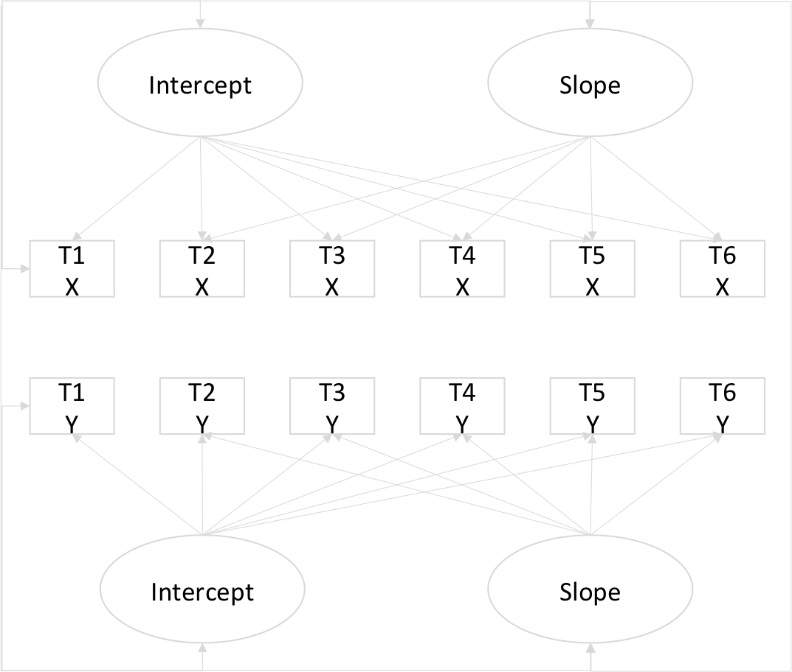


 
```{r, results="hide"}
fit.allX<-ramLCM(data=data,outcome=2:7, model='all')
fitsX<-round(fit.allX$fit[
            c("chisq","df","pvalue","cfi",
              "srmr","rmsea","aic","bic"),],digits=2)
datatable(fitsX,option=list(dom='t'))
```
```{r, results="hide"}
fit.allY<-ramLCM(data=data,outcome=8:13, model='all')
fitsY<-round(fit.allY$fit[
            c("chisq","df","pvalue","cfi",
              "srmr","rmsea","aic","bic"),],digits=2)
datatable(fitsY,option=list(dom='t'))
```


# ALTM

## ALTM

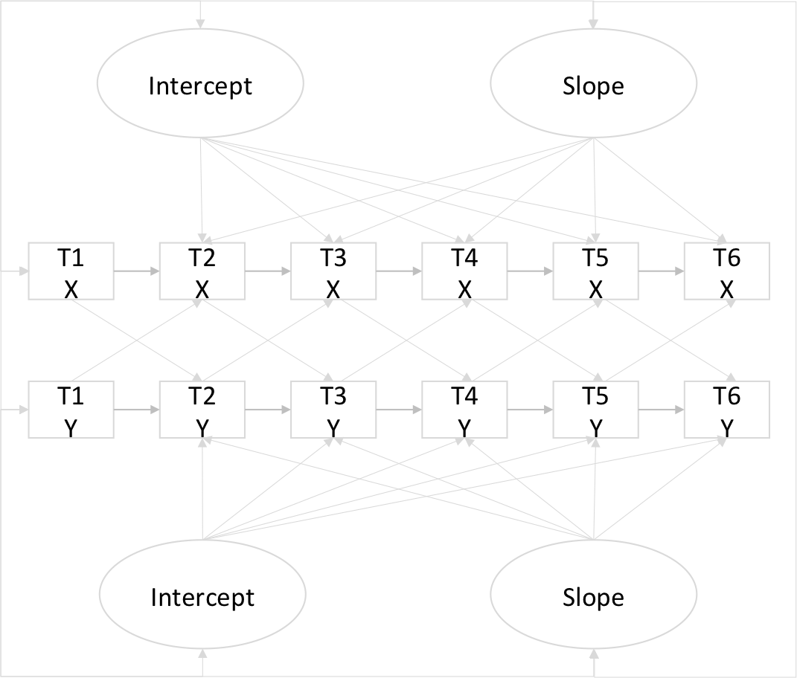

## ２つの時系列データ

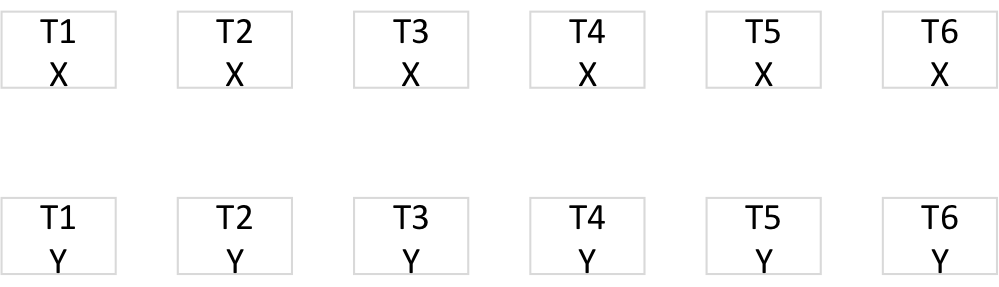

## 交差遅延効果モデル

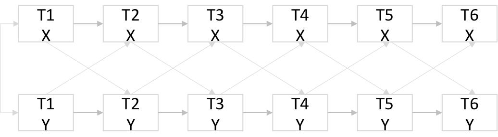


## 成長曲線モデル


## 交差遅延効果+潜在成長曲線=ALTM


## 自己回帰のパス

-変数の安定性
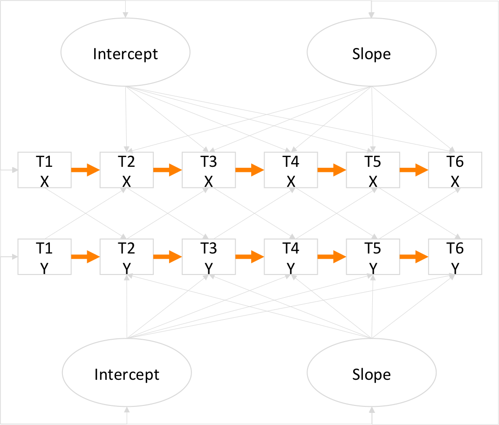

## 交差遅延のパス
- 変数間の因果関係
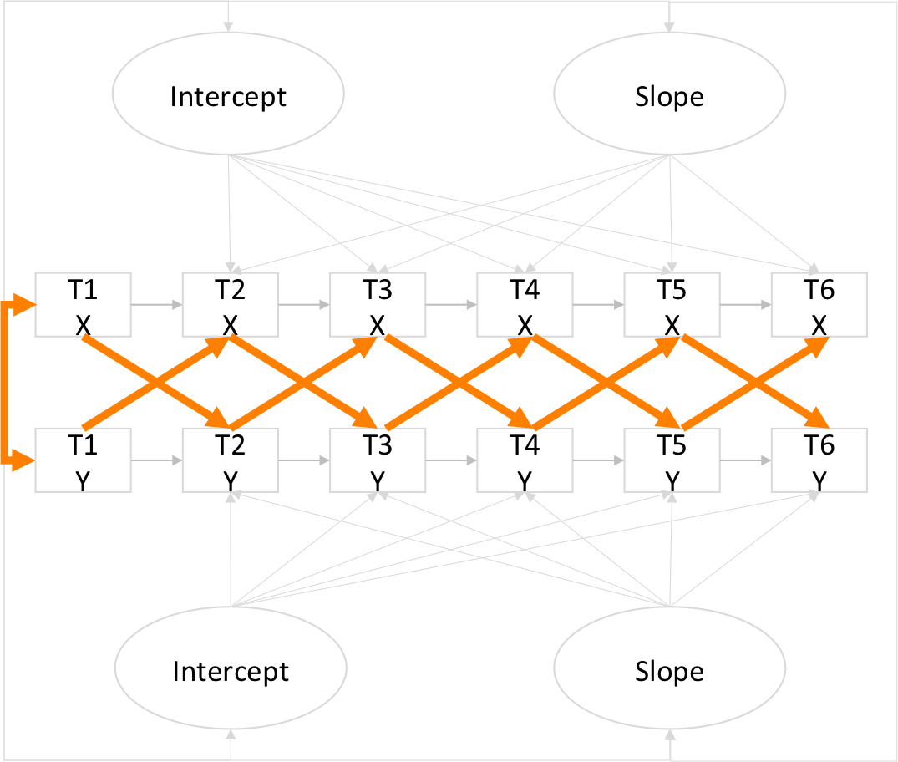

##　切片と傾き (全体の遷移パターン)

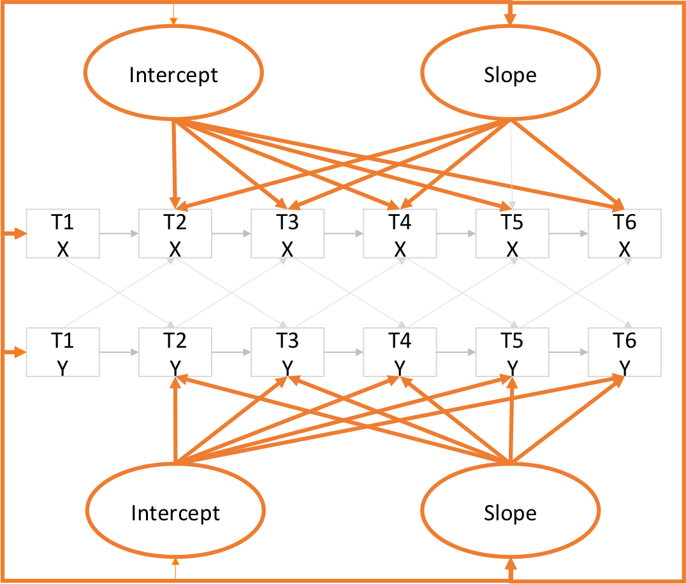


# LCS

## さ


## し

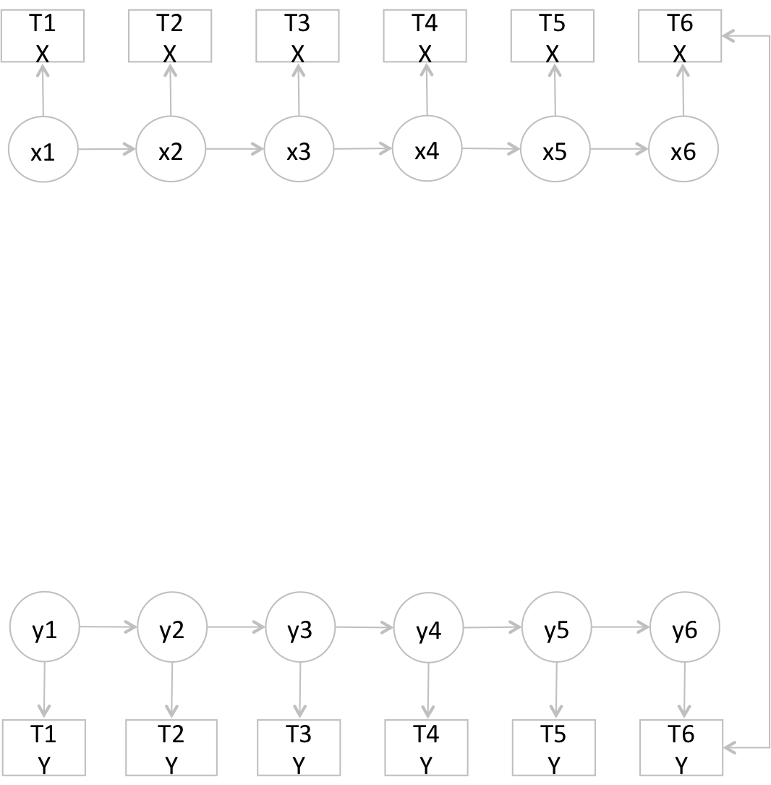

## せ

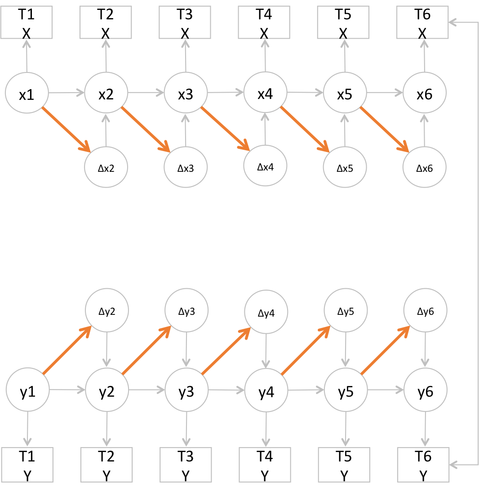


## そ

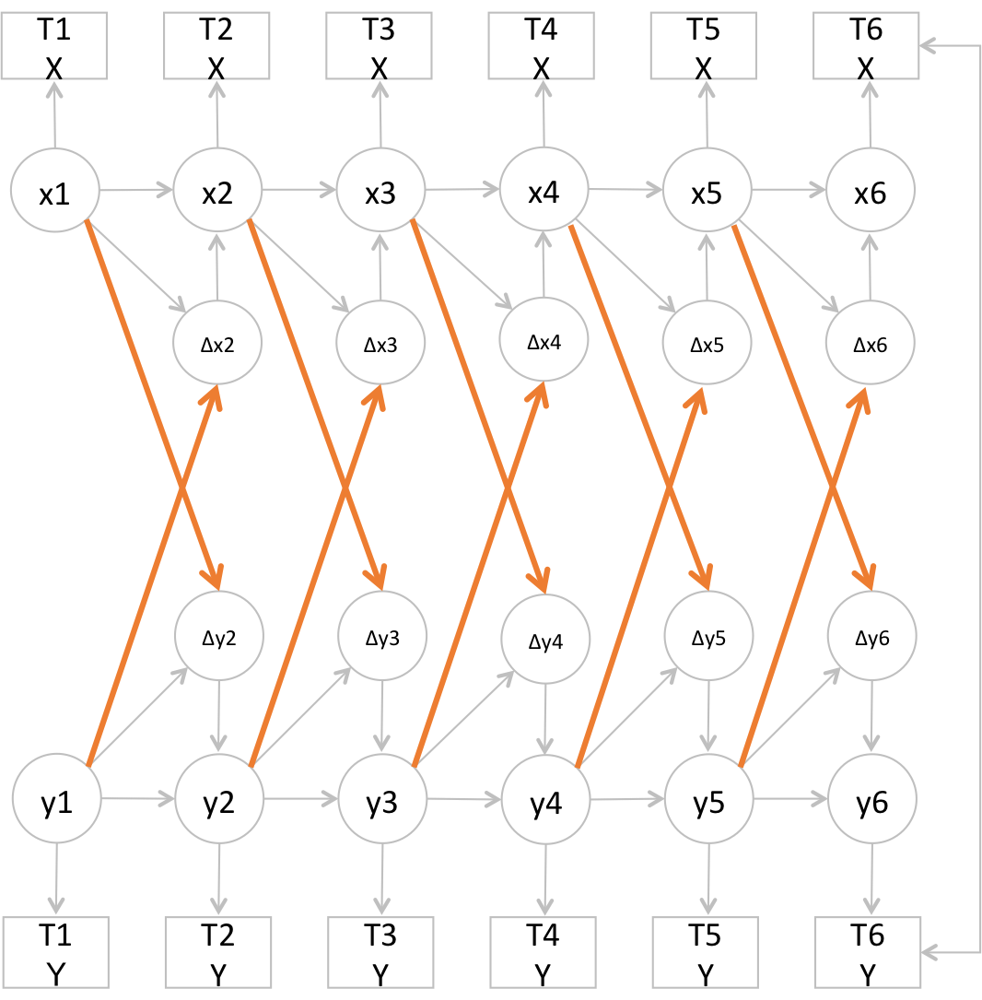

## た

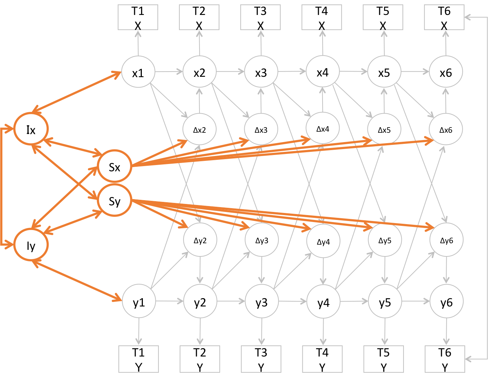

