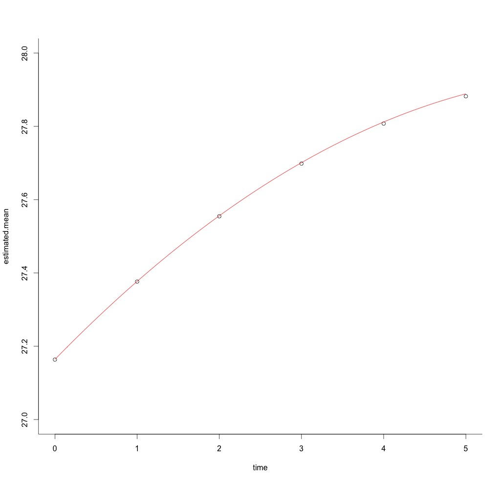
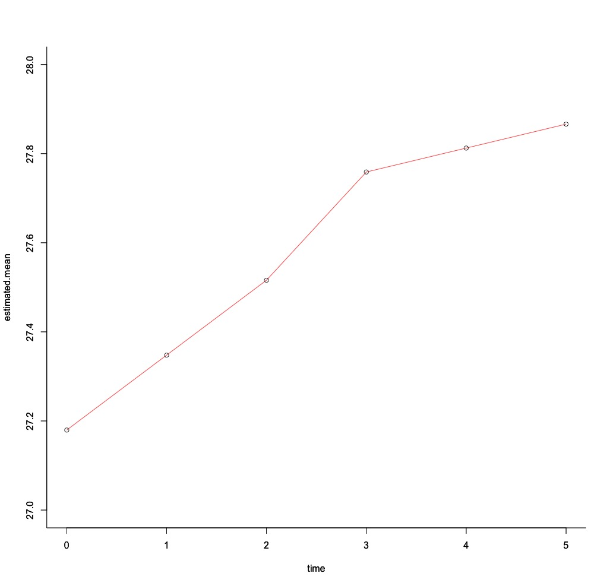
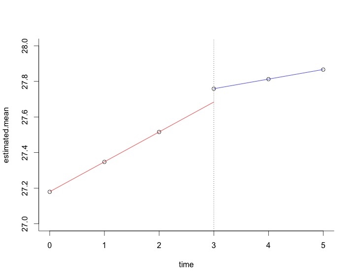

```{r, results='hide',echo=F,message=F,warning=F}
library(knitr)
opts_chunk$set(warning=F, message=F,echo=F)
```

# Topics  

## 　 

### 1. 非線形の成長曲線モデル 
  - polynominal model
  - latetn basis model 
  - piecewise models
  
###　  
  
      
### 2.多変量の成長曲線モデル
  - autoregressive latent trajectory Model
  - latent change score model


# 非線形モデルのモチベ

## ２次(以上)の曲線で

```{r, out.width = 500, fig.retina = NULL}

```
  
### polynominal model  

## データドリブンに

```{r, out.width = 500, fig.retina = NULL}

```
  
### latent basis model  

## ある時点から傾きが異なる

```{r, out.width = 500, fig.retina = NULL}

```
  
### piecewise model  

# サンプルデータ

## BMIの経時データ
```{r,echo=F, results="asis"}
data<-read.csv("data/Garland.csv",header=T)
data<-data[,2:7]

library(ggplot2)
library(plyr)
library(shiny)
library(shinyapps)

M<-as.data.frame(t(sapply(data,each(mean,sd))))
M<-round(M,digits=2)
M$time<-0:5

library(DT)
M2<-t(M)
datatable(M2, options = list(dom = 't'))
```


```{r, fig.width=5, fig.height=2}
ggplot(M, aes(x=time,y=mean, group=1))+ 
              geom_line(col="blue", size=3)+
              ylim(3,4)+
              #geom_line(aes(y=mean.Y,group=1),size=3,col="red")+
              theme_bw()
```

Newsom, J. T. (2015). Longitudinal Structural Equation Modeling: A Comprehensive Introduction. Routledge.  
http://www.longitudinalsem.com/health.dat  


# Rで潜在成長曲線モデル

## lavaanでまじめに書く
```
level =~ 1* bmi1 +1* bmi2 +1* bmi3 +
         1* bmi4 +1* bmi5 +1* bmi6 
slope =~ 0 * bmi1 + 1 * bmi2 + 2 * bmi3 + 
         3 * bmi4 + 4 * bmi5 + 5 * bmi6 
bmi1 ~~(vare)* bmi1 
bmi2 ~~(vare)* bmi2 
bmi3 ~~(vare)* bmi3 
bmi4 ~~(vare)* bmi4 
bmi5 ~~(vare)* bmi5 
bmi6 ~~(vare)* bmi6 
```
結構めんどい...

## 救世主登場
### RAMpathパッケージ  
- 潜在成長曲線系のlavaanコードを自動生成して実行してくれる関数が充実    
    - 成長曲線モデル: ramLCM    
    - 潜在差得点モデル:ramLCS    
    - 2変量の潜在差得点モデル: ramBLCS    
     
- lavaanのモデルを吐き出せるので、RAMpathで実行した後lavaanで微調整という流れで効率よくモデリング

## ramLCM
- 切片のみのモデル (model='no')
    
- 線形モデル (model='linear')
    
- 二次曲線モデル (model='quadratic')
    
- latent basisモデル (model = 'latent')

## 一行で簡潔に推定
### 一気にどん
```{r, echo=T, results='hide'}
library(RAMpath)
fit.all<-ramLCM(data=data,outcome=1:6, model='all')
```

### 個別にどん
```{r, echo=T, results='hide'}
fit.no<-ramLCM(data=data,outcome=1:6, model='no')
fit.linear<-ramLCM(data=data,outcome=1:6, model='linear')
fit.quadratic<-ramLCM(data=data,outcome=1:6, model='quadratic')
fit.latent<-ramLCM(data=data,outcome=1:6, model='latent')
```

## 切片のみモデル
 lavaanコード
```{r, echo=T}
cat(fit.all$model$no)
```

## 線形モデル
 lavaanコード
```{r, echo=T}
cat(fit.all$model$linear)
```

## 二次曲線モデル
 lavaanコード
```{r, echo=T}
cat(fit.all$model$quadratic)
```

## latent basisモデル
 lavaanコード
```{r, echo=T}
cat(fit.all$model$latent)
```

## 適合度

```{r, echo=T}
fits<-round(fit.all$fit[
            c("chisq","df","pvalue","cfi",
              "srmr","rmsea","aic","bic"),],digits=2)
datatable(fits,option=list(dom='t'))
```


## ポチるおまけ 

```{r, echo=F}
datatable(fits, extensions = 'Buttons', 
          options = list(dom = 'Bfrtip',
          buttons = c('copy', 'csv', 'excel', 'pdf', 'print')))
```


## 推定結果の出力

```{r, echo=T}
datatable(parameterEstimates(fit.all$lavaan$quadratic),options=list(dom="t"))
```

## 推定平均値の遷移プロット

```{r, echo=T}
source("script/plot.growth.R")
g<-plot.growth(fit.all, type="quad")
g+ylim(3,4)+theme_bw()
```


# Piecewise Model

##　コード全体

```{r, echo=T}
model1 <-'

#切片因子の設定
i =~ 1*X1 + 1*X2 + 1*X3 + 
1*X4 + 1*X5 + 1*X6

#傾き因子の設定
s1 =~ 0*X1 + 1*X2 + 2*X3 +
3*X4 + 3*X5 + 3*X6

s2 =~ 0*X1 + 0*X2 + 0*X3 +
0*X4 + 1*X5 + 2*X6


#切片と傾きの分散
i ~~ i ; s1 ~~ s1 ; s2 ~~ s2; 

#因子間相関
i ~~ s1 + s2; s1 ~~ s2

#因子平均
i ~ 1 ; s1 ~ 1 ; s2 ~ 1

#誤差分散
X1 ~ 0; X2 ~ 0; X3 ~ 0
X4 ~ 0; X5 ~ 0; X6 ~ 0
'
```

## 切片因子の設定  
- 因子負荷を1に固定 

```
#lavaan code
i =~ 1*t1+1*t2+1*t3+1*t4+1*t5
```
```{r, echo=F}
source("script/diag.R")
library(DiagrammeR)
grViz(int)
```

## 前半の傾きの設定  
前半の傾き(s1)の因子負荷を  
区分時点以降同値に固定  

```
#lavaan model code
i=~0*t1+1*t2+2*t3+3*t4+3*t5+3*t6
```
```{r, fig.align='right', echo=F}
grViz(s1)
```

## 後半の傾きの設定
後半の傾き(s1)の因子負荷を  
区分時点まで0に固定  
```
#lavaan model code
i=~0*t1+0*t2+0*t3+0*t4+1*t5+2*t6
```
```{r, fig.align='right', echo=F}
grViz(s2)
```


## その他の設定
- 切片と傾きの分散を自由推定
- 因子間相関を自由推定
- 因子平均を自由推定
- 誤差分散を0に固定  

```
#切片と傾きの分散
i ~~ i ; s1 ~~ s1 ; s2 ~~ s2
#因子間相関
i ~~ s1 + s2 ; s1 ~~ s2
#因子平均
i ~ 1 ; s1 ~ 1 ; s2 ~ 1
#誤差分散
bmi1 ~ 0; bmi2 ~ 0; bmi3 ~ 0
bmi4 ~ 0; bmi5 ~ 0; bmi6 ~ 0
```


## 推定の実行  

```
library(lavaan)
model1.fit<-lavaan::growth(model1, data)
```
```{r, echo=F}

model1.fit<-lavaan::growth(model1, data=data)


library(tidyr)
newdata<-as.data.frame(lavPredict(model1.fit, type = "ov"))
newdata$id<-1:length(newdata[,1])

newdata.l<-gather(newdata,time,value,X1:X6)
newdata.l$time<-as.factor(newdata.l$time)
newdata.l$time<-as.numeric(newdata.l$time)-1

mean.pred<-apply(newdata,2, mean)
sd.pred<-apply(newdata,2, sd)
low<-mean.pred-1.96*sd.pred
up<-mean.pred+1.96*sd.pred


pred<-data.frame(mean=mean.pred,sd=sd.pred,lowerCI=low,upperCI=up)[-7,]
pred$time<-0:5

library(ggplot2)
ggplot(pred,aes(x=time,y=mean,group=1))+ 
geom_point(size=3)+ylim(3.25, 3.5)+geom_line()+theme_bw()+
geom_vline(xintercept = 3,  lty=2)


#geom_errorbar(aes(ymin=lowerCI,ymax=upperCI,width=.1))
```


## 適合度
```
fit1.m<-round(fitMeasures(model1)[c("chisq","df","pvalue",
"cfi","srmr","rmsea")],digits=2)
fit1.m<-t(as.data.frame(fit1))
print(xtable(fit1.m),comment=F,type="html")
```
```{r, results='asis'}
fit1.m<-round(fitMeasures(model1.fit)
[c("chisq","df","pvalue",
"cfi","srmr","rmsea")],digits=2)
fit1.m<-t(as.data.frame(fit1.m))
datatable(fit1.m,options=list(dom="t"))
```


##　期間ごとに切片が異なるモデル

```{r, echo=T}
model2.2 <-'

i1 =~ 1*X1 + 1*X2 + 1*X3 + 0*X4 + 0*X5 + 0*X6
i2 =~ 0*X1 + 0*X2 + 0*X3 + 1*X4 + 1*X5 + 1*X6
s1 =~ 0*X1 + 1*X2 + 2*X3 + 3*X4 + 3*X5 + 3*X6
s2 =~ 0*X1 + 0*X2 + 0*X3 + 0*X4 + 1*X5 + 2*X6

i1 ~~ i1
i2 ~~ i2
s1 ~~ s1
s2 ~~ s2

i1 ~~ i2 + s1 + s2
i2 ~~ s1 + s2 
s1 ~~ s2
i1 ~ 1
i2 ~ 1
s1 ~ 1 #do s1 ~ a*1 and s2 ~ a*1 to constrain intercepts to be equal for difference test;
s2 ~ 1

X1 ~ 0
X2 ~ 0
X3 ~ 0
X4 ~ 0
X5 ~ 0
X6 ~ 0 '
```


```{r}
library(lavaan)
model2.fit<-lavaan::growth(model2.2, data=data)

newdata2<-as.data.frame(lavPredict(model2.fit, type = "ov"))
newdata2$id<-1:length(newdata2[,1])

library(tidyr)
newdata2.l<-gather(newdata2,time,value,X1:X6)
newdata2.l$time<-as.factor(newdata2.l$time)
newdata2.l$time<-as.numeric(newdata2.l$time)-1

library(plyr)
mean.pred<-apply(newdata,2, mean)
sd.pred<-apply(newdata,2, sd)
low<-mean.pred-1.96*sd.pred
up<-mean.pred+1.96*sd.pred


```

# polynomial models

## 二次以上の曲線モデル  
- quadratic curveなど
- 時間変数のコーディング要検討

```{r, out.width = 400, fig.retina = NULL}

```

## こんなモデル

# latent basis model

## データドリブンに遷移パターンを推定
- 傾きの因子負荷を自由推定する

```{r, out.width = 400, fig.retina = NULL}

```

## こんなモデル


